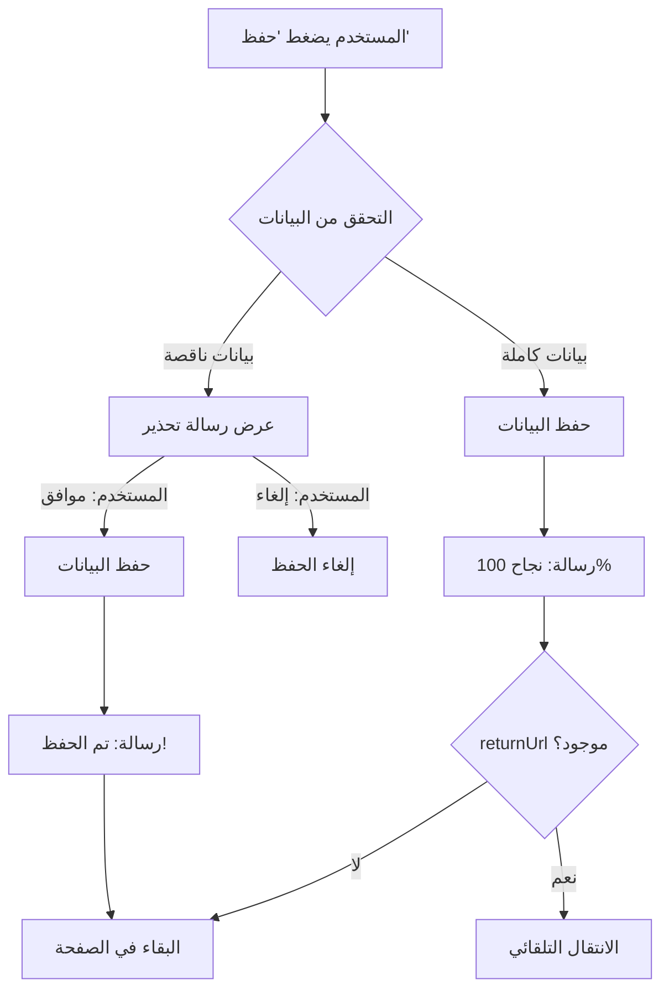

# ميزة الحفظ الجزئي - Partial Save Feature

## 📌 نظرة عامة

تم إضافة ميزة **الحفظ الجزئي** للبيانات الإضافية للعقارات، مما يسمح بحفظ البيانات تدريجياً بدلاً من طلب إدخال كل شيء مرة واحدة.

---

## 🎯 المشكلة التي تم حلها

### **المشكلة السابقة:**
- ❌ النظام لا يحفظ أي بيانات إذا كان هناك حقل إجباري فارغ
- ❌ المستخدم يخسر كل ما أدخله إذا حدث خطأ أو إغلاق غير متوقع
- ❌ يجب إدخال 22 حقل دفعة واحدة
- ❌ تجربة مستخدم سيئة

### **الحل الجديد:**
- ✅ الحفظ يحدث دائماً (حتى مع بيانات ناقصة)
- ✅ رسالة تحذير واضحة بالحقول الناقصة **فقط**
- ✅ البيانات محفوظة في قاعدة البيانات
- ✅ المستخدم يبقى في الصفحة لإكمال البيانات
- ✅ الانتقال التلقائي يحدث فقط عند اكتمال 100%

---

## 🔧 كيف يعمل

### **1. الحفظ الجزئي**

```typescript
const saveData = async () => {
  // 1. التحقق من البيانات الناقصة
  const missingData = validateRequiredData();
  
  // 2. إذا كانت ناقصة - عرض تحذير
  if (missingData.length > 0) {
    const confirmSave = confirm(
      `⚠️ هناك ${missingData.length} حقل ناقص!\n` +
      `البيانات الناقصة:\n${missingList}\n\n` +
      `حفظ على أي حال؟`
    );
    
    if (!confirmSave) return; // المستخدم ألغى
  }
  
  // 3. الحفظ يحدث هنا (دائماً إذا وافق المستخدم)
  await fetch(`/api/properties/${id}/additional`, {
    method: 'POST',
    body: JSON.stringify(data)
  });
  
  // 4. التحقق بعد الحفظ
  if (missingData.length > 0) {
    // ناقص - تبقى في الصفحة
    alert('✅ تم الحفظ! لكن أكمل الباقي...');
  } else {
    // كامل - ننتقل
    alert('✅✅✅ نجاح كامل!');
    if (returnUrl) router.push(returnUrl);
  }
};
```

---

## 📋 سيناريوهات الاستخدام

### **السيناريو 1: إدخال تدريجي**

```
المستخدم يُدخل:
  ✅ بيانات المالك (5 حقول)
  ✅ اسم الحارس ورقمه
  ❌ باقي الحقول فارغة (15 حقل)

عند الحفظ:
  1. تظهر رسالة: "هناك 15 حقل ناقص - حفظ؟"
  2. المستخدم يختار: "موافق"
  3. ✅ البيانات تُحفظ
  4. ⚠️ يبقى في الصفحة
  5. رسالة: "تم الحفظ! أكمل الباقي..."

لاحقاً:
  1. المستخدم يعود للصفحة
  2. ✅ البيانات المحفوظة موجودة
  3. يُكمل الحقول الباقية
  4. اضغط حفظ مرة أخرى
  5. ✅✅✅ نجاح كامل + انتقال تلقائي
```

### **السيناريو 2: حماية من فقدان البيانات**

```
المستخدم يُدخل بيانات كثيرة...
  ⚠️ فجأة: انقطاع كهرباء / إغلاق المتصفح
  
القديم:
  ❌ كل البيانات تضيع!
  
الجديد:
  ✅ يضغط "حفظ" بشكل دوري
  ✅ البيانات محفوظة حتى لو ناقصة
  ✅ عند العودة - كل شيء موجود!
```

---

## ✨ ميزة التعديل

### **المشكلة:**
- أضفت حساب كهرباء برقم الحساب ونوع الدفع
- ❌ نسيت رفع صورة العداد
- ❌ لا يمكن التعديل - فقط حذف وإعادة إضافة!

### **الحل:**
- ✅ زر **"تعديل"** 🔵 بجانب كل حساب
- ✅ نافذة تعديل كاملة
- ✅ يمكن تحديث أي حقل
- ✅ يمكن رفع/تحديث صورة العداد
- ✅ حفظ التعديلات مباشرة

---

## 🎨 واجهة المستخدم

### **أزرار حساب الخدمة:**

```
┌─────────────────────────────────────────────────────┐
│ ⚡ كهرباء                              [نشط]      │
│ رقم الحساب: 12345                                  │
│ نوع الدفع: مسبق الدفع                              │
│                                                     │
│  [🔵 تعديل]  [🟠 استبدال العداد]  [🔴 حذف]      │
│     ↑ جديد!         ↑ للعداد فقط      ↑ خطر       │
└─────────────────────────────────────────────────────┘
```

### **الفرق بين الأزرار:**

| الزر | الوظيفة | متى تستخدمه |
|-----|----------|-------------|
| 🔵 **تعديل** | تعديل بيانات الحساب | لتحديث رقم الحساب، رفع صورة، تغيير نوع الدفع |
| 🟠 **استبدال العداد** | تسجيل تبديل العداد | عندما تُغيّر الشركة العداد الفعلي |
| 🔴 **حذف** | حذف الحساب نهائياً | لإزالة الحساب بالكامل |

---

## 💾 منطق الحفظ

### **الحفظ الجزئي:**



### **الرسائل:**

**1. بيانات ناقصة - قبل الحفظ:**
```
⚠️ تنبيه: هناك 15 حقل ناقص!

البيانات الناقصة:
1. اسم مسؤول الصيانة
2. رقم هاتف مسؤول الصيانة
3. رقم المبنى
...

هل تريد حفظ البيانات الحالية على أي حال؟

ملاحظة: لن يمكنك إنشاء عقود إيجار حتى تكتمل جميع البيانات.

[موافق]  [إلغاء]
```

**2. بيانات ناقصة - بعد الحفظ:**
```
✅ تم حفظ البيانات المُدخلة بنجاح!

⚠️ ملاحظة: هناك 15 حقل ناقص.
لن يتم الانتقال حتى تكتمل جميع البيانات المطلوبة.

يمكنك إكمالها في أي وقت والضغط على حفظ مرة أخرى.
```

**3. بيانات كاملة:**
```
✅✅✅ تم حفظ جميع البيانات بنجاح! البيانات مكتملة 100%

(ثم الانتقال التلقائي بعد 1.5 ثانية)
```

---

## 🔍 التحقق الذكي

### **الحقول الإجبارية (22 حقل):**

#### **بيانات المالك (6):**
1. الاسم الكامل
2. رقم البطاقة المدنية
3. تاريخ انتهاء البطاقة
4. رقم الهاتف
5. البريد الإلكتروني
6. **نسخة من البطاقة الشخصية (ملف)**

#### **بيانات الموظفين (2):**
1. اسم مسؤول الصيانة
2. رقم هاتف مسؤول الصيانة

#### **بيانات العقار (5):**
1. رقم المبنى
2. نوع استعمال الأرض
3. المنطقة
4. رقم الرسم المساحي
5. رقم القطعة

#### **حساب الكهرباء (3):**
1. رقم الحساب
2. صورة العداد
3. نوع الدفع (مسبق/آجل)

#### **حساب المياه (3):**
1. رقم الحساب
2. صورة العداد
3. نوع الدفع (مسبق/آجل)

#### **المستندات (2):**
1. ملكية العقار
2. الرسم المساحي

---

## 🧪 اختبار الميزة

### **اختبار 1: زر التعديل**

```bash
# الخطوات:
1. افتح الصفحة
2. أضف حساب كهرباء (بدون صورة عداد)
3. اضغط 'حفظ' (سيُظهر تحذير - اضغط موافق)
4. لاحظ زر 'تعديل' 🔵 بجانب الحساب
5. اضغط 'تعديل'
6. ارفع صورة العداد
7. اضغط 'حفظ التعديلات'
8. ✅ الصورة تُضاف!

# النتيجة المتوقعة:
✅ الحساب يُحدّث
✅ الصورة موجودة الآن
```

### **اختبار 2: الحفظ الجزئي**

```bash
# الخطوات:
1. افتح صفحة جديدة
2. املأ فقط: بطاقة المالك + اسم الحارس
3. اضغط 'حفظ'
4. ستظهر رسالة: "هناك 15 حقل ناقص - حفظ؟"
5. اضغط 'موافق'
6. ✅ البيانات تُحفظ
7. ⚠️ تبقى في الصفحة
8. أعد تحميل الصفحة (F5)
9. ✅ البيانات المحفوظة موجودة!
10. أكمل الحقول الباقية
11. اضغط 'حفظ'
12. ✅✅✅ نجاح كامل + انتقال تلقائي

# النتيجة المتوقعة:
✅ لا تفقد البيانات أبداً
✅ يمكن الإدخال التدريجي
✅ الانتقال فقط عند الاكتمال
```

---

## 📊 رسائل النظام

### **1. Confirm Dialog (قبل الحفظ):**
```
⚠️ تنبيه: هناك {count} حقل ناقص!

البيانات الناقصة:
1. اسم مسؤول الصيانة
2. رقم هاتف مسؤول الصيانة
3. رقم المبنى
4. ...

هل تريد حفظ البيانات الحالية على أي حال؟

ملاحظة: لن يمكنك إنشاء عقود إيجار حتى تكتمل جميع البيانات المطلوبة.

[موافق] [إلغاء]
```

### **2. Alert بعد الحفظ (بيانات ناقصة):**
```
✅ تم حفظ البيانات المُدخلة بنجاح!

⚠️ ملاحظة: هناك {count} حقل ناقص.
لن يتم الانتقال حتى تكتمل جميع البيانات المطلوبة.

يمكنك إكمالها في أي وقت والضغط على حفظ مرة أخرى.
```

### **3. Alert بعد الحفظ (بيانات كاملة):**
```
✅✅✅ تم حفظ جميع البيانات بنجاح! البيانات مكتملة 100%

(ثم الانتقال التلقائي بعد 1.5 ثانية)
```

---

## 🔄 التكامل مع صفحة العقود

### **من `/rentals/new` إلى `/properties/[id]/additional`:**

1. المستخدم في صفحة إنشاء عقد جديد
2. يختار عقار ووحدة
3. النظام يتحقق من البيانات الإضافية
4. إذا ناقصة → رسالة تحذير مع رابط مباشر
5. المستخدم يضغط "إكمال البيانات"
6. ينتقل إلى `/properties/[id]/additional?returnUrl=/rentals/new&step=2`

### **في صفحة البيانات الإضافية:**

1. المستخدم يملأ بعض البيانات
2. يضغط "حفظ" → تُحفظ البيانات الجزئية
3. يبقى في الصفحة لإكمال الباقي
4. يُكمل جميع الحقول
5. يضغط "حفظ" مرة أخرى
6. ✅ نجاح كامل
7. 🔙 انتقال تلقائي إلى `/rentals/new` (Step 2)

---

## 💡 فوائد هذا النهج

### **1. تجربة مستخدم أفضل:**
- ✅ لا ضغط لإدخال كل شيء مرة واحدة
- ✅ يمكن الحفظ والعودة لاحقاً
- ✅ واضح ما الذي ينقص بالضبط

### **2. حماية من فقدان البيانات:**
- ✅ الحفظ الدوري يمنع الخسارة
- ✅ حتى لو حدث خطأ - البيانات محفوظة
- ✅ يمكن العودة وإكمال في أي وقت

### **3. مرونة في العمل:**
- ✅ يمكن إدخال البيانات تدريجياً
- ✅ مناسب للعقارات الجديدة (بيانات غير كاملة)
- ✅ لا يمنع إكمال العقود لاحقاً

### **4. التحكم في سير العمل:**
- ✅ البيانات الناقصة لا تمنع من الحفظ
- ✅ لكن تمنع من إنشاء عقود إيجار
- ✅ توازن بين المرونة والجودة

---

## 📝 ملاحظات للمطورين

### **State Management:**
```typescript
const [editingService, setEditingService] = useState<ServiceAccount | null>(null);
const [showEditService, setShowEditService] = useState(false);
```

### **Edit Handler:**
```typescript
// فتح modal التعديل
const openEditModal = (service: ServiceAccount) => {
  setEditingService(service);
  setShowEditService(true);
};

// حفظ التعديلات
const saveEdits = () => {
  const updatedAccounts = serviceAccounts.map(s => 
    s.id === editingService.id ? editingService : s
  );
  setServiceAccounts(updatedAccounts);
  setShowEditService(false);
  setEditingService(null);
};
```

---

## ✅ الخلاصة

الميزات الجديدة توفر:
- 🔵 **زر تعديل** لحسابات الخدمات
- 💾 **حفظ جزئي** مع حماية من فقدان البيانات
- ⚠️ **رسائل واضحة** بالحقول الناقصة فقط
- 🔒 **التحكم في سير العمل** - الانتقال فقط عند الاكتمال

**النتيجة:** تجربة مستخدم أفضل + أمان أعلى للبيانات! ✅

